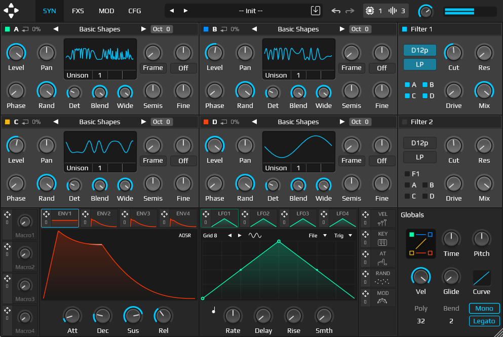

<h1 align="center">
  <!--  -->
  TetraOP
  <br>
</h1>
<div align="center">

[](https://github.com/tiagolr/tetraop/releases)
[](https://github.com/tiagolr/tetraop/releases)
[](https://github.com/tiagolr/tetraop/releases)

</div>
<div align="center">

[](https://github.com/tiagolr/tetraop/releases/latest)


</div>

TetraOP is a wavetable synth with four oscillators, FM, Unison, ring modulation and more.



My first attempt at a wavetable synthesizer, it is based of Ableton Operator and combines four wavetable oscillators with phase and ring modulation. Its built using [Gin](https://github.com/FigBug/Gin/tree/master) and Juce.

Overall it's a well executed synth with good performance and SIMD across voices, it doesn't have however wavetable editor or a great filter section or a preset browser etc, due to FM not playing well with wavetables I am not sure I'll be adding new features either.

## Features

* Wavetable based synthesis
* 4 operators with FM and RM routing
* 10 predefined FM layouts
* FM and RM routing matrix
* 16 Unison voices per operator
* 5 Unison modes
* 8 Phase distortion modes
* 2 Filters with 5 types and 4 modes each
* Drag-and-drop modulation system
* Envelopes, LFOs, Macros and other modulation sources

## Download

Check the [Releases](https://github.com/tiagolr/tetraop/releases) page.

## Build

```bash
git clone --recurse-submodules https://github.com/tiagolr/tetraop.git

# windows
cmake -G "Visual Studio 18 2026" -DCMAKE_BUILD_TYPE=Release -S . -B ./build
cmake -B build
cmake --build build

# linux
sudo apt update
sudo apt-get install libx11-dev libfreetype-dev libfontconfig1-dev libasound2-dev libxrandr-dev libxinerama-dev libxcursor-dev
cmake -G "Unix Makefiles" -DCMAKE_BUILD_TYPE=Release -S . -B ./build
cmake --build ./build --config Release

# macOS
cmake -G "Unix Makefiles" -DCMAKE_BUILD_TYPE=Release -DCMAKE_OSX_ARCHITECTURES="x86_64;arm64" -S . -B ./build
cmake --build ./build --config Release
```
